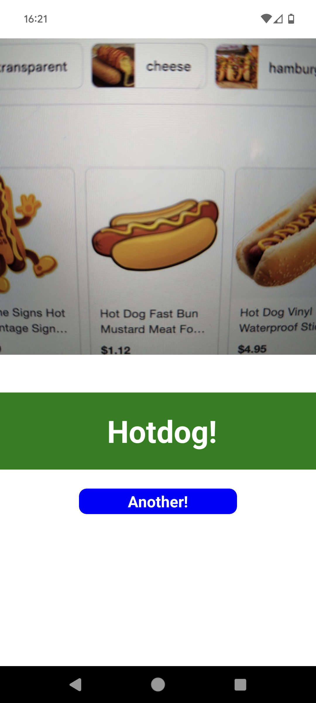
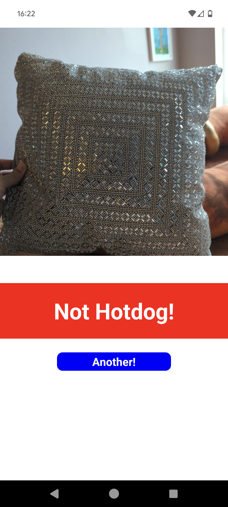
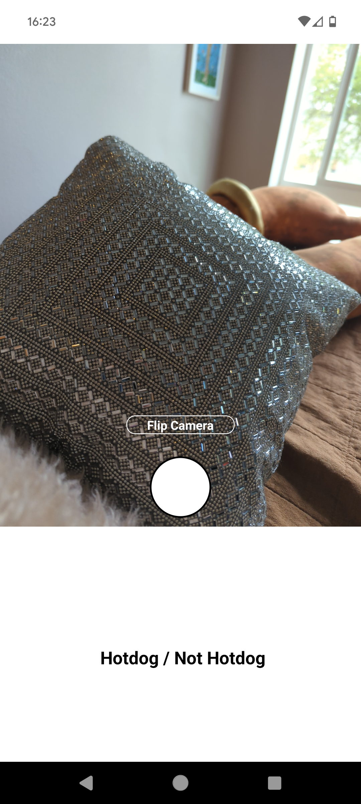
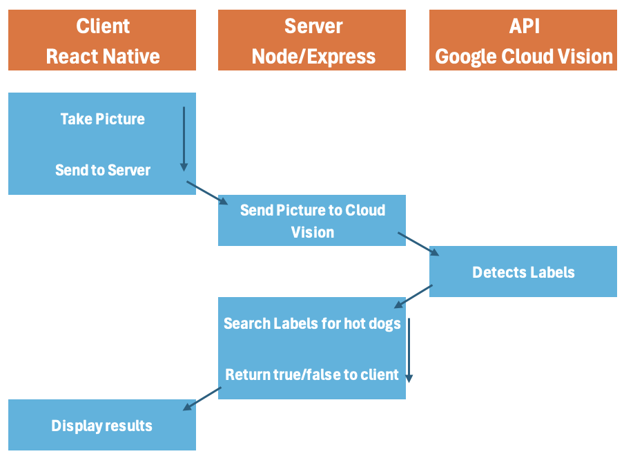

# HotDogOrnot
My recreation of Jian Yang's Hot Dog App from Silicon Valley.

 Expo React-Native App with a Node/Express Server that sends the image to Google Cloud Vision for analysis.

 Video: 

# App
<div>



</div>

# Architecture


Tutorials that helped:
- 
- https://www.freecodecamp.org/news/how-to-create-a-camera-app-with-expo-and-react-native/ 
- https://stackoverflow.com/questions/58634905/camera-preview-in-expo-is-distorted


## Setup
```
mkdir HotDogOrNot               // create the root folder
cd HotDogOrNot                  // go into root folder
mkdir server                    // create a server folder
npx create-expo-app client      // create an expo app
cd client                       // go into expo app
npx expo start                  // run expo app
```

1.Edit app.js and add components

2.Add an index.js to server folder and code up server

## Running
1. navigate a terminal to client `npx expo start` to start app.
2. In another terminal window from HotDogOrNot folder `node server/index.js` to run server
